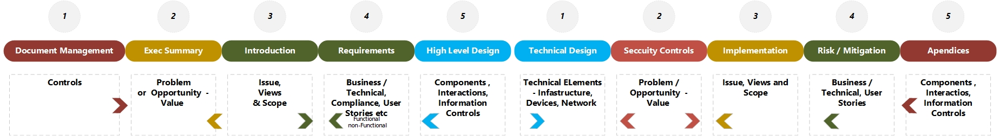

[January 14, 2024](https://dalbanger.blogspot.com/2024/01/solution-design-table-of-contents.html "permanent link")

Today’s short blog, the first for 2024, derives from recent work in which I required a classic **Table of Contents (TOC)** for a Solution Design(**SD**) Document/ Artefact.

To create this TOC, I began by listing elements one would expect to see in the artefact i.e. primary section headers, which is challenging when you consider the ‘**_purpose’_** of the document, and  the **_target audience_** both of which impact the overall structure of the document.

For most artefacts, it would be prudent to tailor the SD to meet the needs and challenges of the specific  problem. For example, a basic SD for a new _in-house_ development may be very technical, especially when the target audience may be the Systems Community (_Developers, Testers, Service Management_ etc.) and resulting in an artefact with the content and focus on _Component Views(Building Module Blocks) , Deployment Views and the Runtime Operations_. 

So, when I considered the elements for the SD Artefact I wanted to create a **generic TOC**, one which could be re-used for a wider audience and this resulted in the headings shown below.

To generate the TOC, I decided to create a simple document with the above headings. This document was then further expanded to add context and descriptions for each heading resulting - the result was the autogenerated TOC depicted below.

  
The Table below provides a brief description of each heading shown and a narrative for use.  

| Heading                    | Description                                                                                                                                                            |
| -------------------------- | ---------------------------------------------------------------------------------------------------------------------------------------------------------------------- |
| Document Management         | This is the control section of the document and provides the metadata for the Solution Design (SD) document i.e., the date of document creation, location, fast updated and by whom, which is often represented as a set of tables, examples of possible content are listed below.                  |
| Executive Summary          | This section of the document summarizes key points found in this document and provides a snapshot of the context and salient points addressed.                            |
| Introduction                | This is the main body of the Solution Design Document and should contain as much ‘known’ information as practically possible to provide sufficient information for stakeholders (developers, testers etc). If there are any gaps that have been identified, then this section should highlight this and provide any mitigating actions to be confirmed (TBC) |
| Requirements                | This section of the document highlights and references the main requirements for the solution and should be presented in a format that meets the organizational standard. Requirements should map and trace back to the Capabilities, Services and Enablers leveraged to realize the Solution.      |
| High-Level Component Views | In this section of the document, we seek to present a view which encapsulates a set of high-level components which form part or all the solution, these views can represent the services and enablers that are required for the realization of the solution and the section should state both internal and external boundaries of the system. |
| Technical Design / Inventory | In some cases, it may be necessary, for clarity, to show the next level of decomposition for the components of the solution (we normally refer to this as the level 2 set of attributes). Whilst this section of the document often presents a high-level view of the services and enablers and associated technical components you may wish to use the appendices to show the lower level of detail and use this section to keep it at a high abstract level. We may wish to discuss the inventory of components that will be used in this section |
| Impact Analysis             | The Impact Analysis (IA) section can be brief or extended subject to the complexity of the solution. The IA should highlight any major impact of any proposed changes in terms of interactions, process, people, or organizational changes.    |
| Security Architecture       | In most cases, your Organization will have specific control, policies and or guardrails which the Solution must comply with, and documents completed or complied before any solution can be deployed into production.       |
| Implementation Approach     | This section is normally light weight in content and will reference the project plan, backlogs and defined sprints.                                                          |
| Risks, Mitigation & Treatment | Risks may be identified in the Security or Impact section, however if there is a set of specific high level of risk associated with the project (timelines, dependencies etc) then this should be documented. Below are some considerations.        |
| Appendices                   | This will obviously be dependent on the content in the SD however, some considerations should be given to.  - Referenced Documents  - Compliance Matrix (optional) - Glossary of Terms / Acronyms|

> As  mentioned previously , the TOC should be adapted to suit the problem. however, the above should provide some generic items to consider.