# **Understanding the C4 Model for Software Architecture Documentation**


When it comes to documenting software systems, using a structured and effective approach is crucial. One such approach is the C4 model, which provides a clear and hierarchical way of representing different levels of detail in software system diagrams. The C4 model can be used to document software systems effectively. Whether you are a beginner or an experienced developer, understanding the C4 model will help you create comprehensive and meaningful system diagrams.

# **What is the C4 Model?**

The [C4 model](https://c4model.com/), created by Simon Brown, is a hierarchical approach to visualizing the architecture of a software system. It consists of four levels of diagrams, with each level providing increasing detail and granularity.

## The four levels are:

**Level 1: System Context diagram:** The [system context diagram](https://c4model.com/#SystemContextDiagram) is the highest-level diagram that provides an overview of the entire system and its interactions with external entities. It focuses on actors (customers with specific roles) and systems, showcasing the relationships between them.
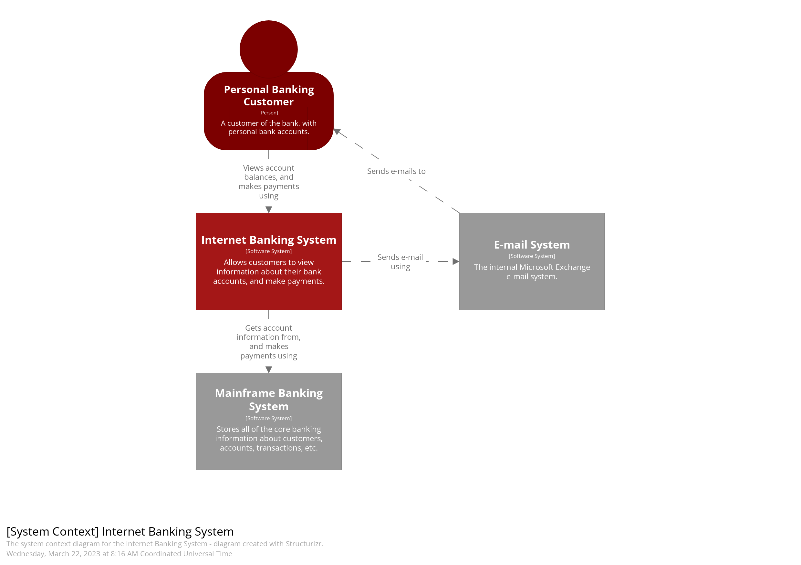
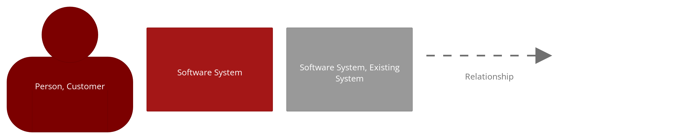

**Level 2: Container diagram:** The [container diagram](https://c4model.com/#ContainerDiagram) zooms in from the system context and focuses on the major containers that host code or store data within the system. It provides a more detailed view of the system’s architecture, including the different types of containers and their interactions.
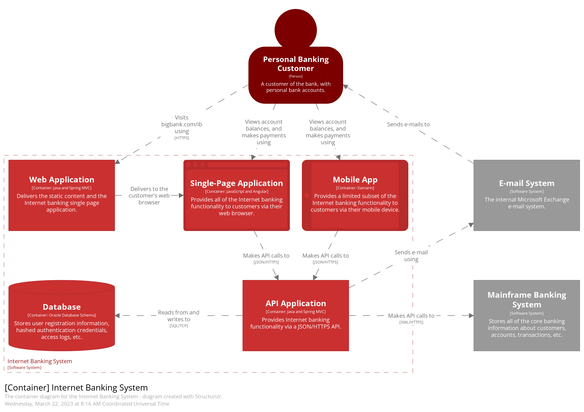
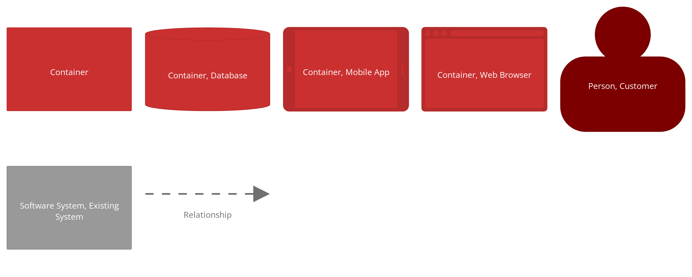

**Level 3: Component diagram:** The [component diagram](https://c4model.com/#ComponentDiagram) further zooms in and shows the major structural building blocks of the application and their interactions. It represents the key components of the system and how they fit together to provide functionality.
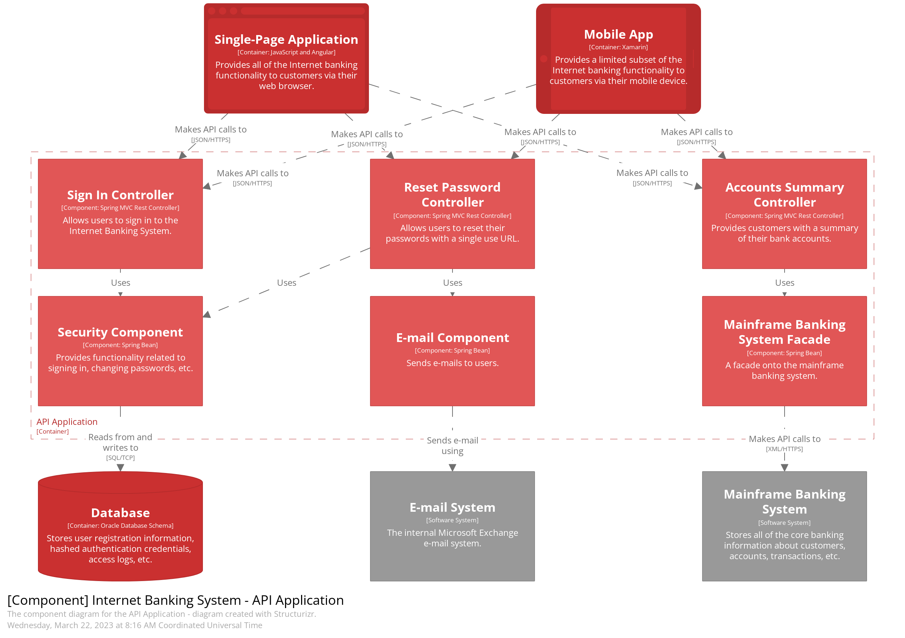
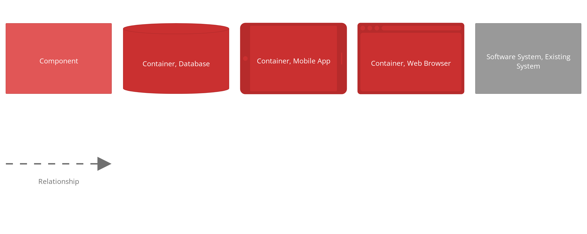

**Level 4: Code diagram:** The [code diagram](https://c4model.com/#CodeDiagram) is the deepest level of zoom and provides a 1–1 mapping with the actual code of the system. While this diagram exists, it is often not used as the code itself serves as a visual representation, and there are better tools out there for this purpose.
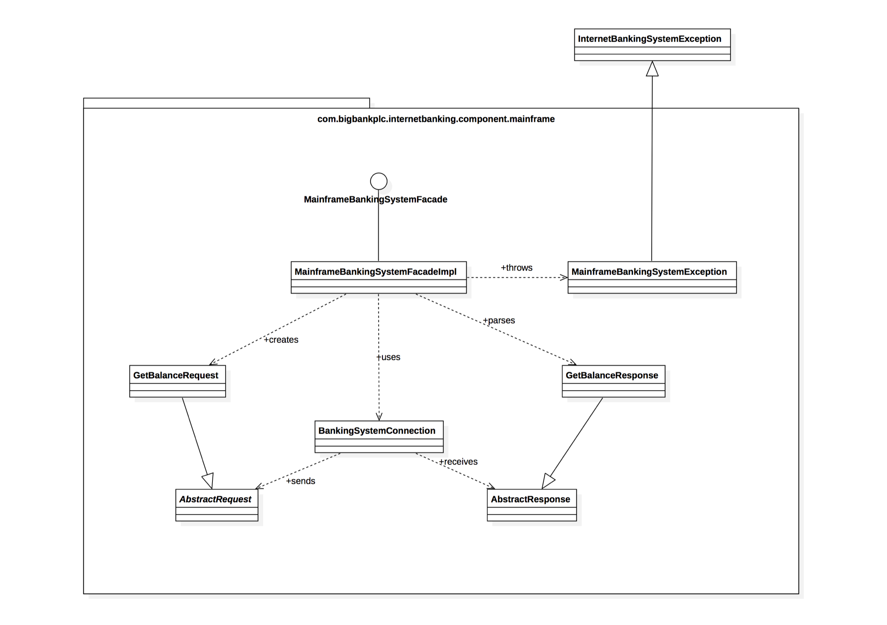

In addition to these four levels, there are a few supplementary diagrams that are worth mentioning:

- **System Landscape diagram:** The [system landscape diagram](https://c4model.com/#SystemLandscapeDiagram) provides a view of all the software systems within an enterprise. It helps in understanding the overall context and relationships between different systems. From a pragmatic viewpoint, a system landscape diagram essentially serves as a system context diagram, but without emphasizing a specific software system.
 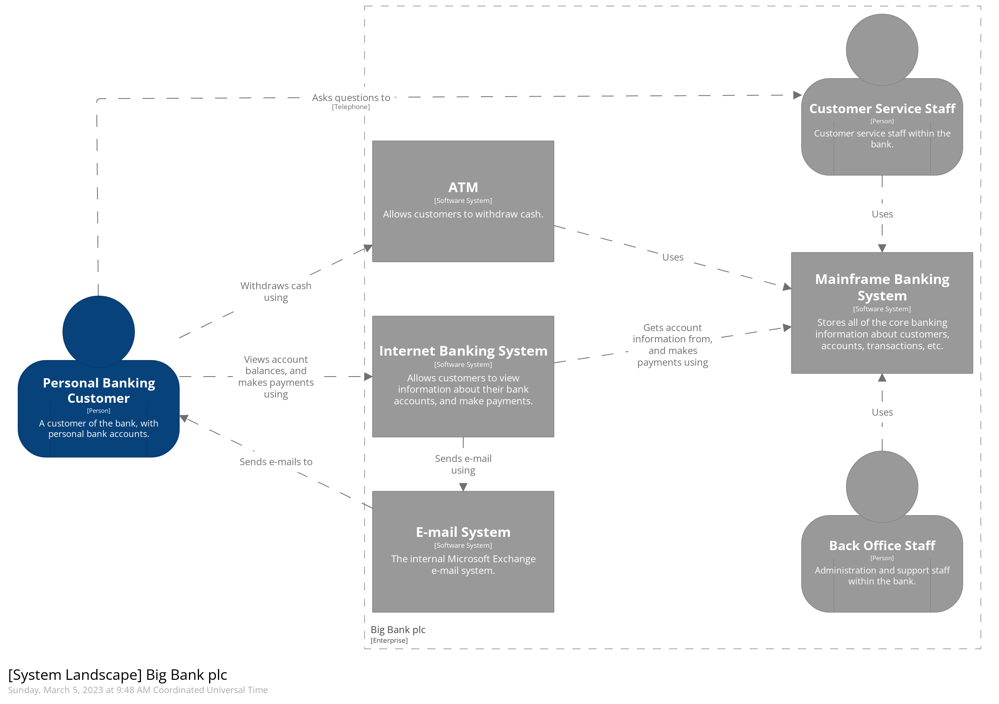

  
- **Deployment diagram:** The [deployment diagram](https://docs.structurizr.com/dsl/cookbook/deployment-view/) focuses on the infrastructure aspects of the system, including networking, CDNs, gateways, load balancers, and resource groups. It helps in understanding how the system is deployed and the dependencies on external services.
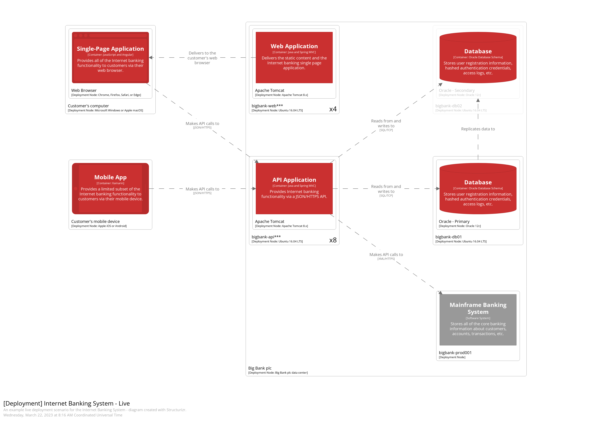
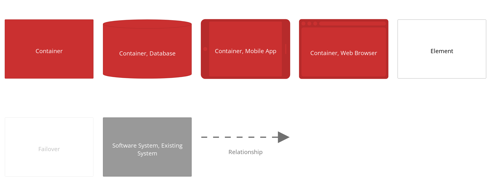
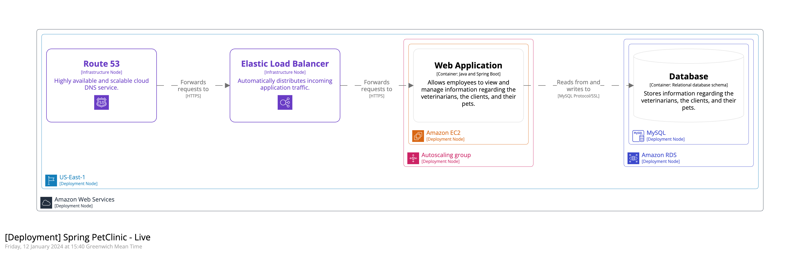

- **Dynamic diagram:** The [dynamic diagram](https://docs.structurizr.com/dsl/cookbook/dynamic-view/) is a cut-down version of any of the previous diagrams and is used to show specific features or use cases. It can be thought of as similar to a sequence diagram, showcasing the interactions between components or containers.
 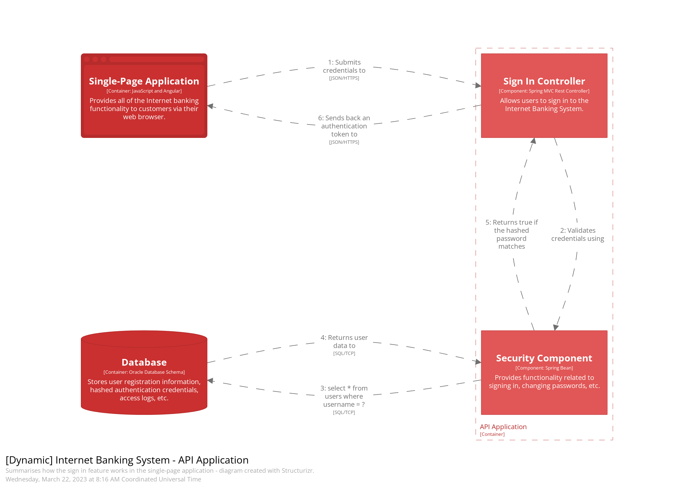
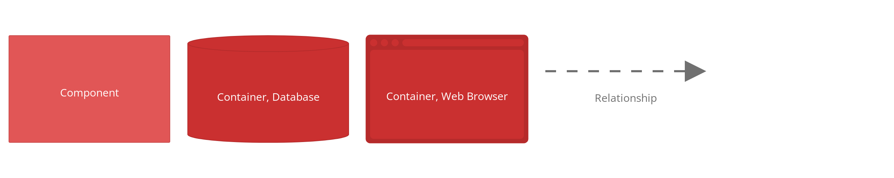

# Modeling vs Diagramming

Before we dive deeper into the C4 model, it’s important to understand the difference between modeling and diagramming. Modeling is the act of describing the system, including its actors, systems, containers, components, and their relationships. It focuses on capturing the structure and behavior of the system. On the other hand, diagramming is the process of visually representing the model. It involves creating diagrams that depict the different elements of the model in a clear and understandable way.

The distinction between modeling and diagramming becomes powerful when we can create a single model and reuse different elements of it in multiple diagrams. This allows us to apply the DRY (Don’t Repeat Yourself) principle to our diagrams, making them more maintainable and reducing duplication of effort.

# Introducing Structurizr

Now that we have a good understanding of the C4 model and its different levels, let’s explore a tool that can help us create these diagrams effectively. Structurizr is an excellent tool that enables us to model a system using a custom DSL (Domain-Specific Language) and then generate multiple diagrams from that model. It provides a seamless way to create, visualize, and document software architectures.

# Setting up Structurizr

To get started with [Structurizr](https://structurizr.com/), we need to set up the tool. There are different versions available, but for our purposes, Structurizr Lite works fantastic. It can be installed locally via Docker. Let’s walk through the Docker installation process:

- Pull the Structurizr Lite image from Docker Hub:

docker pull structurizr/lite

- Run the container, exposing a port on the host and providing a path to our working directory:

docker run -it — rm -p 8080:8080 — name structurizr-lite -v C:/PATH\_LOCAL\_DRIVE:/usr/local/structurizr structurizr/lite

It’s important to note that one Docker image can only point to one working directory. If you have multiple workspaces in different directories, you’ll need to have one container running for each of them, and you’ll want to run on different ports, so you’ll adjust the -p 8081:8081 or whatever port you wish to use. You can manage these containers easily using [Docker Desktop](https://www.docker.com/products/docker-desktop/).

# Creating Models and Diagrams with Structurizr

Once we have Structurizr up and running, we can start creating our models and diagrams. Let’s take an example of an e-commerce system and build a model for it. Here’s how the model might look:

```
workspace {  
 model {  
   enterprise {  
  customerPerson = person "Customer"  
  warehousePerson = person "Warehouse Staff"  
  
  ecommerceSystem = softwareSystem "Example E-Commerce Store" {  
    storeContainer = container "Web App SPA" "E-Commerce Store" "Angular" "Browser,Microsoft Azure - Static Apps,Azure"  
    stockContainer = container "Stock Management Portal SPA" "Order fulfillment, stock management, order dispatch" "Angular" "Browser,Microsoft Azure - Static Apps,Azure"  
    dbContainer = container "Database" "Customers, Orders, Payments" "SQL Server" "Database,Microsoft Azure - Azure SQL,Azure"  
    apiContainer = container "API" "Backend" "ASP.NET Core" "Microsoft Azure - App Services,Azure" {  
   group "Web Layer" {  
     policyComp = component "Authorization Policy" "Authentication and authorization" "ASP.NET Core"  
     controllerComp = component "API Controller" "Requests, responses, routing and serialization" "ASP.NET Core"  
     mediatrComp = component "MediatR" "Provides decoupling of requests and handlers" "MediatR"  
   }  
   group "Application Layer" {  
     commandHandlerComp = component "Command Handler" "Business logic for changing state and triggering events" "MediatR request handler"  
     queryHandlerComp = component "Query Handler" "Business logic for retrieving data" "MediatR request handler"  
     commandValidatorComp = component "Command Validator" "Business validation prior to changing state" "Fluent Validation"  
   }  
   group "Infrastructure Layer" {  
     dbContextComp = component "DB Context" "ORM - Maps LINQ queries to the data store" "Entity Framework Core"  
   }  
   group "Domain Layer" {  
     domainModelComp = component "Model" "Domain models" "DTO/POCO classes"  
   }  
    }  
  }  
  
  emailSystem = softwareSystem "Email System" "Sendgrid" "External"  
  
  customerPerson -> storeContainer "Places Orders" "https"  
  warehousePerson -> stockContainer "Dispatches Orders" "https"  
  apiContainer -> emailSystem "Trigger emails" "https"  
  emailSystem -> customerPerson "Delivers emails" "https"  
  
  stockContainer -> apiContainer "uses" "https"  
  storeContainer -> apiContainer "uses" "https"  
  apiContainer -> dbContainer "persists data" "https"  
  
  dbContextComp -> dbContainer "stores and retrieves data"  
  storeContainer -> controllerComp "calls"  
  stockContainer -> controllerComp "calls"  
  controllerComp -> policyComp "authenticated and authorized by"  
  controllerComp -> mediatrComp "sends queries & commands to"  
  mediatrComp -> queryHandlerComp "sends query to"  
  mediatrComp -> commandValidatorComp "sends command to"  
  commandValidatorComp -> commandHandlerComp "passes command to"  
  queryHandlerComp -> dbContextComp "Gets data from"  
  commandHandlerComp -> dbContextComp "Update data in"  
  dbContextComp -> domainModelComp "contains collections of"  
   }  
 }  
   
     views {  
  
        systemlandscape "SystemLandscape" {  
                include ecommerceSystem emailSystem  
                autoLayout  
            }  
              
        systemContext ecommerceSystem "Context" {  
            include \* emailSystem  
            autoLayout  
        }  
  
        container ecommerceSystem "Container" {  
            include \*  
            autoLayout  
        }  
  
        component apiContainer "Component" {  
            include \* customerPerson warehousePerson  
            autoLayout  
        }  
  
        themes default "https://static.structurizr.com/themes/microsoft-azure-2021.01.26/theme.json"  
  
        styles {  
            element "Azure" {  
                color #ffffff  
            }  
            element "External" {  
                background #783aba  
                color #ffffff  
            }  
            element "Database" {  
                shape Cylinder  
            }  
            element "Browser" {  
                shape WebBrowser  
            }  
        }  
    }  
}
```

_For the full dsl on my GitHub,_ [_click here_](https://github.com/Shelman2/c4modeling/blob/main/workspace.dsl)

The DSL used to create the model may seem a bit complex at first, but it follows a straightforward syntax. Each element in the model is defined using a specific DSL command, such as person, softwareSystem, container, or component. Relationships between elements are defined using the -> operator, along with a description and transport information.

Once we have our model defined, we can generate different diagrams from it using Structurizr. Let’s take a look at how we can generate the context, container, and component diagrams.

# Generating Context Diagrams

To generate a context diagram, we can use the following view definition:

```
systemContext ecommerceSystem "Context" {  
  include \*  
  emailSystem  
  autoLayout  
}  
```

This view definition includes all elements from the model and adds the emailSystem as an external system. The autoLayout command ensures that the diagram is automatically laid out for better readability. Running this view definition will generate a context diagram for our e-commerce system, showcasing the relationships between actors, systems, and the external email system.

# Generating Container Diagrams

To generate a container diagram, we can use the following view definition:

```
container ecommerceSystem "Container" {  
  include \*  
}
```

This view definition includes all elements from the model, generating a container diagram that showcases the major containers within the system and their interactions. Running this view definition will give us a container diagram that provides a more detailed view of the system’s architecture.

# Generating Component Diagrams

To generate a component diagram, we can use the following view definition:

```
component apiContainer "Component" {  
  include \*  
  customerPerson  
  warehousePerson  
  autoLayout  
}
```

This view definition includes all elements from the model, along with the `customerPerson` and `warehousePerson` actors. The `autoLayout` command ensures that the diagram is automatically laid out for better readability. Running this view definition will generate a component diagram that showcases the major components within the system and how they interact with the actors.

# Additional Features of Structurizr

In addition to generating diagrams from models, Structurizr provides additional features to help with documenting architectures. It allows for adding documentation and [Architectural Decision Records](https://dev.to/simonbrown/visualising-adrs-3klm) (ADRs) to the model, making it a comprehensive tool for software architecture documentation.

# Wrapping it up

We explored the C4 model and how it can be used to document software systems with relative ease. We have learned about the four levels of the C4 model, from the system context diagram to the code diagram, and how each level provides increasing detail and granularity. We have also seen the difference between modeling and diagramming, and how Structurizr can be used as a powerful tool to create, visualize, and document software architectures.

Using the C4 model and Structurizr, you can create comprehensive and meaningful system diagrams that accurately represent the architecture of your software systems. Whether you are a beginner or an experienced developer, understanding and utilizing the C4 model will help you communicate and document your software architectures effectively. So, get started with the C4 model and Structurizr, and take your software documentation to the next level!