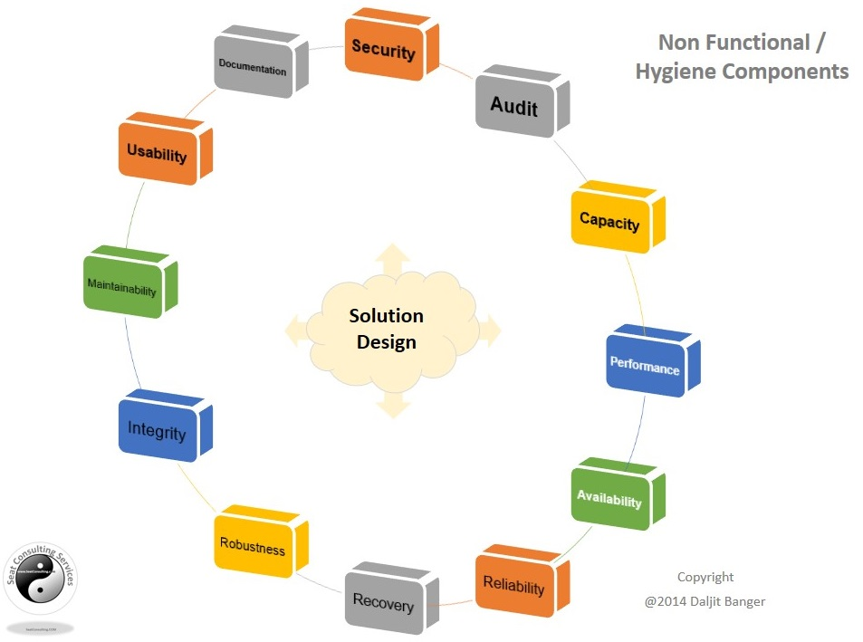
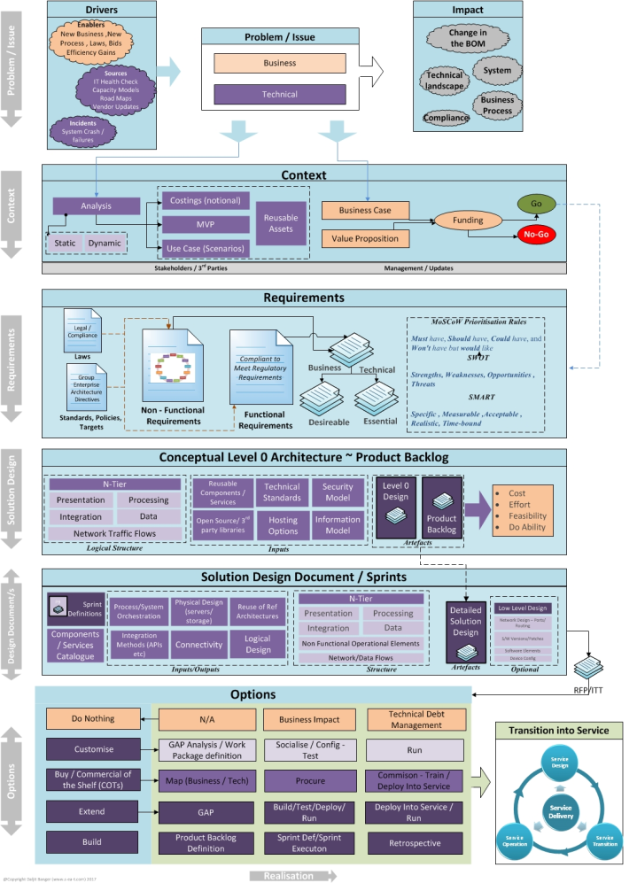
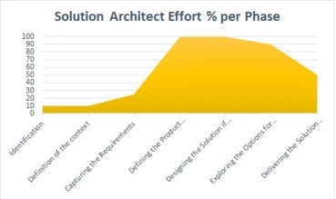

# architecture

## Notes to consider

- Principles
- As is and to be
  - Tactical and strategic to be
- Diagrams
  - C4 Model
  - Sequence diagrams
  - BPMN
  - Use case
  - activity
  - State
  - Timing
- Inputs to Architecture
  - General
    - Business Strategy and Objectives
  - Products specific
    - Business drivers
    - Product Requirements 

## Artefacts

- Project/Product Specific
  - Stakeholder Map
  - 
  - Solution Vision and Scope: 
    - This document outlines the overall vision, objectives, and scope of the solution.
  - Architecture Requirements: 
    - These are the specific requirements that the solution architecture must address.
  - Current State Assessment: 
    - An analysis of the existing systems, processes, and technologies that the solution will interact with or replace.
  - Solution Architecture Design: 
    - This includes high-level and detailed architecture diagrams, component specifications, and interface designs.
  - Risk Assessment and Mitigation Plan: 
    - Identification of potential risks to the solution's success and strategies to mitigate them.
  - Implementation and Transition Plan: 
    - A roadmap for implementing the solution, including timelines, resource requirements, and transition strategies.
  - Architecture Decision Log (ADR's - Architecture Decision Records) : 
    - A record of key decisions made during the architecture design process and the rationale behind them.
  - Compliance and Governance Documentation: 
    - Documentation related to regulatory compliance, security requirements, and governance standards.
- General
  - API Design Guidelines
  - Best practices
    - Input to
      - Coding Standards
  - Common Accepted Design Patterns

## Requirements

- Consider NFR's and not just Functional requirements

### A Basic Non-Functional Requirements Checklist

NFR checklists are not unique products, they are easily found on the web with numerous examples available for reuse, one such example can be found at the Open Group’s website under the ToGAF Requirements Management section.

> Most of you are probably familiar with NFR’s – However if not, you can consider them a set of requirements/criteria used during the run-time operation of a system and not the specific behaviours that the system must exert.

The NFR’s vary in importance and are usually  aligned to the **context of the system** e.g. Operational Safety could be classed as a NFR, especially when working in hazardous conditions (Oil Rigs, Gas Plants etc.), but not a common NFR in most system designs I have come across.

The diagram below highlights most common NFR’s, and are presented together with typical examples in the table below;

Non Functional Components

<table width="767" border="1" cellspacing="0" cellpadding="0"><tbody><tr><td width="212">
NFA
</td><td valign="top" width="555">
<strong>NFR – &nbsp; Examples</strong>
</td></tr><tr><td width="212">
<b>Security</b>

(<i>define key security requirements</i>)

<b>&nbsp;</b>
</td><td valign="top" width="555"><ul><li>&nbsp; <b>Login</b> / Access levels</li><li>&nbsp; Create, Read, Update, and Delete (CRUD) levels.</li><li>&nbsp; Access permissions for application data may only be &nbsp; changed by the system’s data administrator</li><li>&nbsp; <b>Password</b> requirements – &nbsp; length, special characters, expiry, recycling policies, 2FA</li><li>&nbsp; Inactivity <b>timeouts</b> &nbsp; – durations, actions, traceability</li><li>&nbsp; System data backed up every <i>x</i> hours and copies stored in a secure off-site location</li><li>&nbsp; <b>Encryption</b> (data in flight &nbsp; and at rest) – All external communications between the system’s data server &nbsp; and clients must be <b>encrypted</b></li><li>&nbsp; Data <b>Classification</b> &nbsp; / System Accreditation: All Data must be protectively marked and stored / protected.</li></ul></td></tr><tr><td width="212">
<b>Audit</b>

<b>&nbsp;</b>(<em>Define the level of traceability for &nbsp; transactions required</em>)
</td><td valign="top" width="555"><ul><li>&nbsp; System must maintain full <b>traceability</b> of transactions</li><li>&nbsp; Audited <b>Objects</b> &nbsp; are defined</li><li>&nbsp; Audited database fields – which data fields require audit &nbsp; info?</li><li>&nbsp; File <b>characteristics</b> &nbsp; – size before, size after, structure</li><li>&nbsp; User and transactional time <b>stamps</b>, etc</li></ul></td></tr><tr><td width="212">
<b>Capacity</b>

<b></b><i>(Provisioning for growth)</i>

<b>&nbsp;</b>
</td><td valign="top" width="555"><ul><li>&nbsp; <b>Throughput</b> – how many &nbsp; transactions at <b>peak time</b> does the &nbsp; system need to be able to handle</li><li>&nbsp; <b>Storage</b> – (memory/disk) – &nbsp;volume of data the system will page / &nbsp;persist at run time to disk</li><li>&nbsp; Year-on-year <b>growth</b> &nbsp; requirements&nbsp; (users, processing &amp; storage)</li><li>&nbsp; e-channel growth projections</li></ul></td></tr><tr><td width="212">
<b>Performance</b>

<b>&nbsp;</b>
</td><td valign="top" width="555"><ul><li>&nbsp; <b>Response times</b> – application &nbsp; loading, browser refresh times, etc.</li><li>&nbsp; <b>Processing times</b> – functions, &nbsp; calculations, imports, exports</li><li>&nbsp; <b>Query</b> and <b>Reporting</b> times – initial loads and &nbsp; subsequent loads, ETL times</li><li>&nbsp; <b>Interoperbility</b></li></ul></td></tr><tr><td width="212">
<b>Availability</b>

<b>&nbsp;</b><i>(uptime)</i><b></b>
</td><td valign="top" width="555"><ul><li>&nbsp; Hours of operation</li><li>&nbsp; holidays, maintenance times, etc</li><li>&nbsp; • Locations of operation – where should it be available &nbsp; from, what are the connection requirements?</li></ul></td></tr><tr><td width="212">
<b>Reliability</b>
</td><td valign="top" width="555"><ul><li>&nbsp; The ability of a system to perform its required &nbsp; functions under stated conditions for a specific period of time.</li><li>&nbsp; Mean Time Between Failures – What is the acceptable &nbsp; threshold for down-time?</li><li>&nbsp; Mean Time To Recovery – if broken, how much time is &nbsp; available to get the system back up again?</li></ul></td></tr><tr><td width="212">
<b>Recoverability</b>

(in the event of failure..)
</td><td valign="top" width="555"><ul><li>&nbsp; Recovery <b>process</b></li><li>&nbsp; Recovery Point Objectives <b>(RPO)</b></li><li>&nbsp; Recovery Time Objectives <b>(RTO)</b></li><li>&nbsp; Backup frequencies – how often is the transaction data, &nbsp; config data, code backed-up?</li></ul></td></tr><tr><td width="212">
<b>Robustness</b>
</td><td valign="top" width="555"><ul><li>&nbsp; The ability of the system to resist change without &nbsp; adapting its initial stable configuration – operational characteristics with growth?</li><li>&nbsp; Fault trapping (I/O) , Application Hooks, SMNP – how to &nbsp; handle failures ?</li></ul></td></tr><tr><td width="212">
<b>Integrity</b>

<b>&nbsp;</b><b><i>(</i></b><i>Consistency of events,&nbsp;values, methods, measures, expectations &amp; outcomes)</i><b><i></i></b>
</td><td valign="top" width="555"><ul><li>&nbsp; Application Integrity</li><li>&nbsp; Data integrity – referential integrity in database &nbsp; tables and interfaces</li><li>&nbsp; Information Integrity – during transformation</li></ul>
&nbsp;
</td></tr><tr><td width="212">
<b>Maintainability</b>

<i>(The ease with which the system can be maintained)</i><b></b>
</td><td valign="top" width="555"><ul><li>&nbsp; Conformance to Enterprise Architecture standards</li><li>&nbsp; Conformance to Technical design standards</li><li>&nbsp; Conformance to coding standards</li><li>&nbsp; Conformance to best practices.</li></ul></td></tr><tr><td width="212">
<b>Usability</b>
</td><td valign="top" width="555"><ul><li>&nbsp; User Standards (<b>Look &nbsp; / Feel</b>)</li><li>&nbsp; Internationalization / localization requirements – &nbsp; languages, spellings, keyboards, etc</li></ul></td></tr><tr><td width="212">
<b>Documentation</b>
</td><td valign="top" width="555"><ul><li>&nbsp; User Documentation</li><li>&nbsp; System Documentation (Production Acceptance?)</li><li>&nbsp; Help?</li><li>&nbsp; Training Material</li></ul></td></tr></tbody></table>

## The Solution Architecture Life Cycle

Each layer of the Solution Architect Lifecycle is briefly discussed below. However, it must be noted that the focus at each layer will be aligned to the top layer i.e. the problem/issue.

### Identification

Often a problem requires a working group to establish if something is worth considering e.g. bid on a project or to discuss a ‘pattern’ that is emerging in the technology landscape which requires investigation from the reporting systems e.g. Capacity & Performance / Security incidents.

Solution Architects are often engaged at this stage to provide advice on possible options for resolving a problem and to assist in triggering the next phase of the activity.

### Defining the context of the problem/issue

No project or programme of work in real terms commences without a Business Case i.e. a document that captures the reasoning for initiating a project or task with basic costings and outcomes documented. If the problem issue is a Technical one then the Solution Architect is required to elaborate (in simplistic terms) the context of the problem from the systems viewpoint.

### Capturing the Requirements

During the requirements capture phase the Solution Architect will spend much of his/her time focusing on the system elements of the requirements and trying to understand the system components characteristics.

During this stage, there will be a bias towards the non-functional elements of the system.

During this stage, a Minimum Viable Product can be elicited from stakeholders, i.e. the minimum components and effort that will be required to deliver the functional and non-functional requirements can be sketched to define further costs analysis.

It must be noted that the requirements must also encapsulate any legal compliance issues e.g. GDPR requirement and any Enterprise Architectural directives.

### Defining Product Backlog and or Level 0 Systems Architecture

Once the problem is _known, documented and decomposed_ into a set of clearly defined functional and non-functional requirements a level 0 systems architecture can be produced to outline a solution.

Advertisement

Privacy Settings

Where possible reusable components should be highlighted to shorten time to market and increase savings to the project.

At this stage, the outcome should be a level 0 design and in many cases, result in a product backlog for the solution

The level 0 design will facilitate the project to determine the cost and effort involved to deliver the outcome required.

### Designing the Solution and breaking down the deliverables into sprints

At this stage, a detailed analysis of the Level 0 is undertaken and elaborated further to deliver a detailed design document and the subsequent technical sprints to deliver the project.

Depending on the Solution it may be prudent to produce a low-level design to support the Solution Design.

### Options for realising the solution and enacting

I have discussed previously the options that are available for analysis from “do nothing” to “Build” but from a cost / do ability view the option should be selected that leverages existing relationships /services and best value for money.

### Delivering Solution into production

Developing, procuring  or modifying a system requires deployment into a production environment and thus the Solution Architect must be capable of defining the environments (test, prod, pre-prod) for the _route to live_. Often this will involve working with the Service Architects to design the Service and the operational elements (often extrapolated from the NFRs) of the system.

If we were to take all the elements above and assign time that the Solution Architect would be involved in the project then we could produce a graph like the one below;

In summary, the Solution Architect is an important role and requires skills that evolve with each engagement and has a role to play from problem realisation to delivery into service of a solution.

